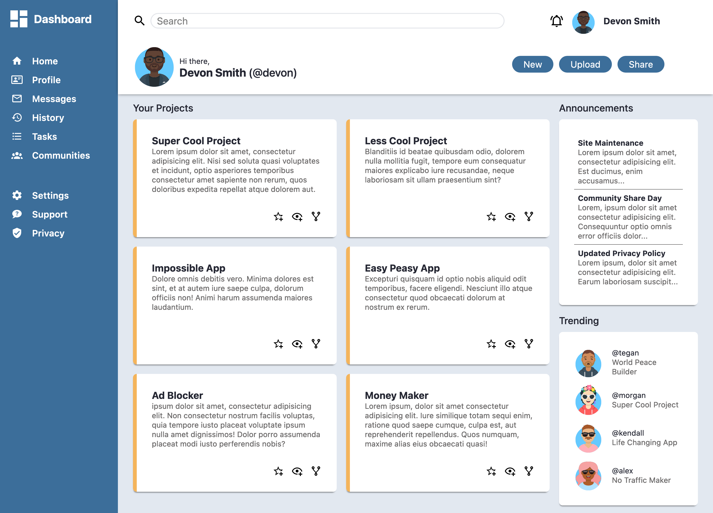

# admin-dashboard

This is my solution to the Odin Project's [Admin Dashboard](https://www.theodinproject.com/lessons/node-path-intermediate-html-and-css-admin-dashboard). 

## Overview
For this project I built an admin dashboard using CSS Grid to create the layout and align elements on the page. I decided to recreate the dashboard design from the design file linked below. 

Overall I am pleased with the way the site turned out. I still have much to learn, but I am comfortable using grid. I plan to revisit this project in the near future to make it more responsive for mobile users.  

### Screenshot

### Links

- [Live Site](https://dasmith963.github.io/admin-dashboard/)

## Acknowledgments

- [Design File](https://cdn.statically.io/gh/TheOdinProject/curriculum/43cc6ab69fdfbef40d431a65677d2144668930ac/intermediate_html_css/grid/project_admin_dashboard/imgs/dashboard-project.png)

